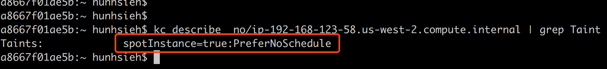

# eks-templates

#### EKS nodeGroup with SpotFleet or ASG w/ spot instance support

*This is an complementary cloudformation template that help you optionally choose spot fleet or ASG w/ spot instances to provision your Amazon EKS node group.*

#### HOWTO

1. Use **eksctl** to provision your Amazon EKS cluster([walkthrough guide](https://github.com/pahud/amazon-eks-workshop/blob/master/00-getting-started/create-eks-with-eksctl.md))
2. Use this alternative cloudformation template to update the nodegroup created by **eksctl** - https://s3-us-west-2.amazonaws.com/pahud-cfn-us-west-2/eks-templates/cloudformation/nodegroup.yaml

This template will generate both ASG and Spot Fleet for you. You can optionally let ASG to provision on-demand instances for you while SpotFleet provision diversified spot instances registering into the same Kubernetes cluster.

## Node Labels, Taints and Tolerations

By default, all the on-demand instances managed by ASG(Autoscaling Group) will have the label **asgnode=true** while the spot instances will have **spotfleet=true**. Use the node selector to better schedule your workload

Additionally, all the spot instances have a **spotInstance=true:PreferNoSchedule** taint. To deploy your Pod on spot instances, use the node label selector to specify **spotfleet=true**, otherwise the pod will not be scheduled on the spot instances unless it has relevant toleration. ([Taint and Toleration in Kubernetes](https://kubernetes.io/docs/concepts/configuration/taint-and-toleration/)).

# Dev Version Template

Dev version has some new features and will be moving to stable version. Feel free to test it and feedback to me.

- [x] Latest Amazon EKS AMI with **/etc/eks/bootstrap.sh** support ([#8](https://github.com/pahud/eks-templates/issues/8))
- [x] Kubelet Extra Arguments support ([#8](https://github.com/pahud/eks-templates/issues/8))
- [x] Select custom AMI ID or leave it default as the latest EKS-optimized AMI ID([#9](https://github.com/pahud/eks-templates/issues/9))

https://s3-us-west-2.amazonaws.com/pahud-cfn-us-west-2/eks-templates/cloudformation/nodegroup-dev.yaml

# Spot Termination Handling

Worried about the spot instance termination? Check [**pahud/eks-lambda-drainer**](https://github.com/pahud/eks-lambda-drainer) to learn how to handle the spot instance termination 120 seconds before the final execution of the termination and get your all running pods re-scheduled onto another node.