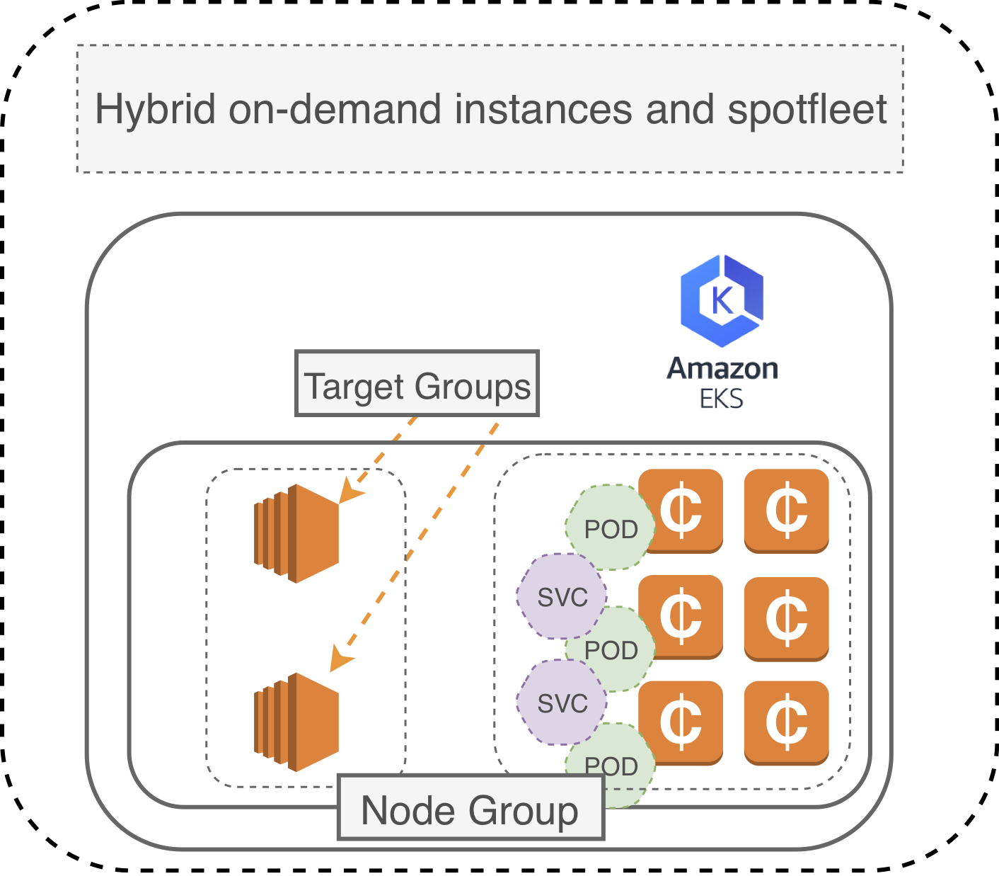
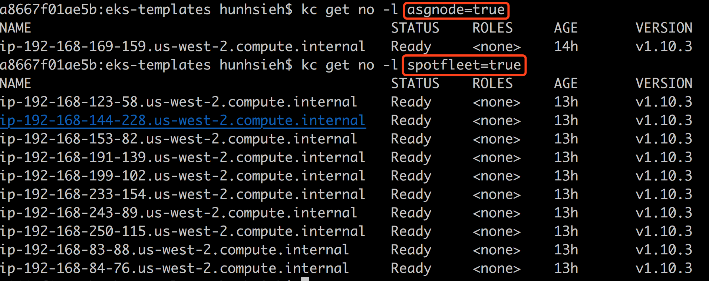

# eks-templates


#### Amazon EKS cloudformation templates

*This is a complementary cloudformation template of nested stacks that helps you provision your Amazon EKS cluster and nodegroup with mixed instance types and purchase options*



## Features

- [x] Creates both Amazon EKS cluster and NodeGroup in a single cloudformatoin nested stack template
- [x] Abstracts away the CLI control in the `Makefile` - simply `make create-eks-cluster` or `make update-eks-cluster`. That's all.
- [x] Fully support the latest Autoscaling Group features to hybrid on-demand and spot instances
- [x] No need to create a seperate SpotFleet
- [x] on-demand instances will have node label **ondemand=yes**
- [x] spot instances will have node label **spotfleet=yes** and a **spotInstance=true:PreferNoSchedule** taint
- [x] support private subnets
- [x] support non-RFC1918 IP/CIDR VPC subnets
- [x] support the latest EKS-optimized AMI auto selection


## HOWTO

1. You may create this stack with contains the EKS cluster and the `nodegroup`. Simple enter this URL in the cloudformation console: https://s3-us-west-2.amazonaws.com/pahud-cfn-us-west-2/eks-templates/cloudformation/eks.yaml
or cerate it simply with

```
$ make create-eks-cluster
```
(you need to modify the `Makefile` first)

2. If you have cready created your cluster with **eksctl**, you may simply update the existing `nodegroup` with this cloudformation template: https://s3-us-west-2.amazonaws.com/pahud-cfn-us-west-2/eks-templates/cloudformation/nodegroup.yaml


## AWS CLI sample

You may use `aws-cli` to deploy the cloudformation stack as below with your own parameter overrides.

```
AWS_ACCOUNT_ID=$(aws sts get-caller-identity --query 'Account' --output text)
EKS_YAML_URL=https://s3-us-west-2.amazonaws.com/pahud-cfn-us-west-2/eks-templates/cloudformation/eks.yaml
CLUSTER_STACK_NAME=eksdemo
VPC_ID=vpc-e549a281
SG_ID=sg-064d7e7c3fd058fc0
CLUSTER_NAME=eksdemo
CLUSTER_ROLE_ARN=arn:aws:iam::${AWS_ACCOUNT_ID}:role/eksServiceRole

aws --region ${REGION} cloudformation create-stack --template-url ${EKS_YAML_URL} \
--stack-name  ${CLUSTER_STACK_NAME} \
--capabilities CAPABILITY_IAM CAPABILITY_AUTO_EXPAND \
--parameters \
ParameterKey=VpcId,ParameterValue=${VPC_ID} \
ParameterKey=SecurityGroupIds,ParameterValue=${SG_ID} \
ParameterKey=ClusterName,ParameterValue=${CLUSTER_NAME} \
ParameterKey=ClusterRoleArn,ParameterValue=${CLUSTER_ROLE_ARN} \
ParameterKey=KeyName,ParameterValue=${SSH_KEY_NAME} \
ParameterKey=SubnetIds,ParameterValue=subnet-05b643f57a6997deb\\,subnet-09e79eb1dec82b7e2\\,subnet-0c365d97cbc75ceec
	
```	

## Node Labels, Taints and Tolerations

By default, all the on-demand instances will have **asgnode=yes** label while spot instances will have **spotfleet=yes**. Use the node selector to better schedule your workload




Additionally, all the spot instances have a **spotInstance=true:PreferNoSchedule** taint. To deploy your Pod on spot instances, use the node label selector to specify **spotfleet=yes**, otherwise the pod will not be scheduled on the spot instances unless it has relevant toleration. ([Taint and Toleration in Kubernetes](https://kubernetes.io/docs/concepts/configuration/taint-and-toleration/)).


# Spot Termination Handling

Worried about the spot instance termination? Check [**pahud/eks-lambda-drainer**](https://github.com/pahud/eks-lambda-drainer) to learn how to handle the spot instance termination 120 seconds before the final execution of the termination and get your all running pods re-scheduled onto another node.
